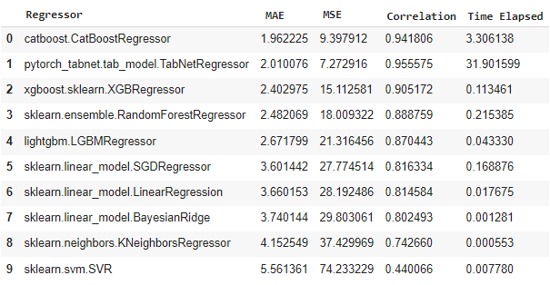

# Machine-Learning-Regression-Models

## Introduction

This project aims to show how to employ some popular machine learning regressors and Scikitlearn tools to build the regression model and do regression analysis. 

The machine learning regressors we employed in this project include: 

|              Regressor Type               |                 Frameworks                   |
|                  :---:                    |                   :---:                      |
|             Linear Regressor              |    sklearn.linear_model.LinearRegression     |
|          Random Forest Regressor          |    sklearn.ensemble.RandomForestRegressor    |
|      K-Nearest Neighbours Regressor       |    sklearn.neighbors.KNeighborsRegressor     |
|     Support Vector Machine Regressor      |               sklearn.svm.SVR                |
|   Stochastic Gradient Descend Regressor   |      sklearn.linear_model.SGDRegressor       |
|            Bayesian Regressor             |     sklearn.linear_model.BayesianRidge       |
|       Categorical Boosting Regressor      |          catboost.CatBoostRegressor          |
|    Extreme Gradient Boosting Regressor    |         xgboost.sklearn.XGBRegressor         |
| Light Gradient Boosting Machines Regressor|            lightgbm.LGBMRegressor            |
|     Network regressor for Tabular Data    |   pytorch_tabnet.tab_model.TabNetRegressor   |

We will also construct a deep neural network model to make comparisons. 

The time required to train these models, as well as their MAE and MSE, are then tabulated in a table, with the latter obtained using the SciKitlearn tools. 

## Input Data  

Boston House Price dataset is used as the input data in this project.

## Code
[To explore the data](Machine_Learning_Regression_Models.ipynb)  
[Compact code for comparison](ML_Regressor_Comparison.ipynb)

## Result

Compared with the deep neural network(DNN), these models are significantly faster, and some of them even can outperform the DNN in terms of accuracy!

